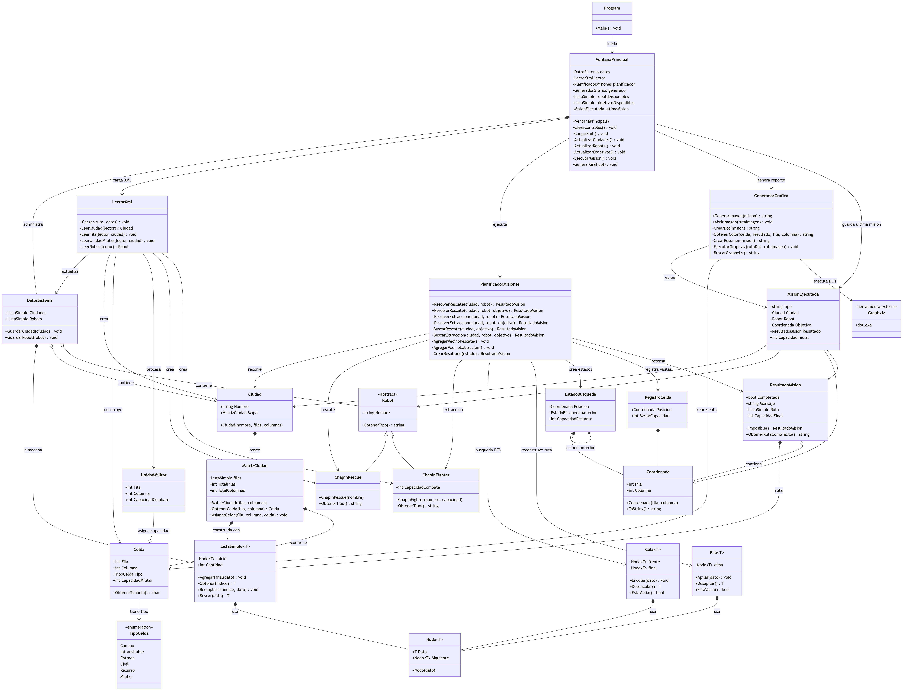
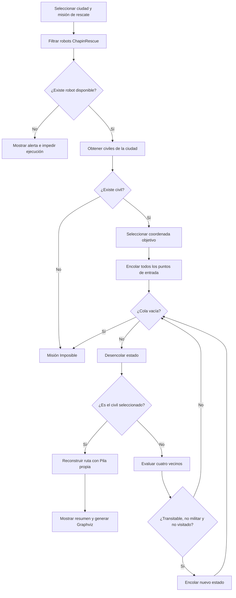
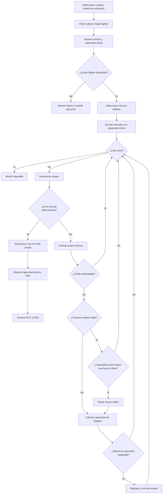

<div align="center">

# Universidad de San Carlos de Guatemala

## Facultad de Ingeniería

### Escuela de Ciencias y Sistemas

### Introducción a la Programación y Computación 2

<br><br>

# Proyecto 1

## Sistema de Control para Chapín Warriors, S. A.

<br><br>

**Estudiante:** José Andrés Díaz Maldonado  
**Carné:** 202505653  
**Curso:** Introducción a la Programación y Computación 2  
**Lenguaje de programación:** C#  
**Año:** 2026

</div>

<div style="page-break-after: always;"></div>

# Introducción

Las operaciones de rescate y extracción en una ciudad afectada por un conflicto requieren tomar decisiones a partir de información incompleta, condiciones cambiantes y restricciones de seguridad. En el escenario planteado para Chapín Warriors, S. A., los drones denominados ChapinEyes sobrevuelan las zonas de interés y producen una representación digital de cada ciudad. Esta representación permite identificar entradas, caminos transitables, obstáculos, unidades civiles, recursos y unidades militares. A partir de estos datos, el sistema debe seleccionar una unidad robótica adecuada y calcular una ruta que respete las reglas de la misión.

El problema no consiste únicamente en desplazar un robot desde un origen hasta un destino. En una misión de rescate debe garantizarse que un ChapinRescue nunca atraviese una posición ocupada por una unidad militar. En una misión de extracción, en cambio, un ChapinFighter puede ingresar a una celda militar solamente cuando su capacidad de combate actual sea estrictamente mayor que la fuerza del enemigo. Después de cada enfrentamiento, la capacidad restante cambia y pasa a formar parte del estado necesario para decidir los siguientes movimientos. Por ello, una ruta geométricamente corta no siempre es una ruta válida.

El sistema fue desarrollado en C# bajo el paradigma de programación orientada a objetos. La interfaz final utiliza Windows Forms para permitir la carga de archivos XML, la elección dinámica de ciudades, robots y objetivos, la ejecución de las misiones y la generación de reportes. El almacenamiento interno no depende de las colecciones proporcionadas por .NET. En su lugar se implementaron estructuras enlazadas propias, de acuerdo con las restricciones académicas del proyecto. Esta decisión obliga a comprender la organización de nodos en memoria y a controlar directamente las operaciones de inserción, acceso, reemplazo, encolado y desapilado.

El objetivo del presente ensayo es explicar la abstracción del problema, la arquitectura de la solución, los Tipos de Dato Abstracto empleados, el procesamiento dinámico del XML, los algoritmos de búsqueda y la integración con Graphviz. La explicación se basa en la implementación real del repositorio `IPC2_Proy01_202602_202505653` y no en una solución genérica distinta al programa entregado.

# Definición del problema y abstracción computacional

Una ciudad se modela como una malla rectangular de filas y columnas. Cada posición corresponde a un objeto `Celda`, identificado mediante coordenadas internas de fila y columna. Aunque el programa utiliza índices iniciados en cero para simplificar las operaciones, las coordenadas mostradas al usuario comienzan en uno. Esta conversión evita confusión al seleccionar objetivos o leer los reportes.

El tipo de una celda se representa mediante la enumeración `TipoCelda`. Una celda transitable, representada por un espacio, permite el desplazamiento normal. El carácter `*` identifica una posición intransitable. La letra `E` representa un punto de entrada y puede existir más de uno dentro de una ciudad. La letra `C` señala una unidad civil y la letra `R` un recurso. Finalmente, una unidad militar ocupa una coordenada específica y agrega una capacidad de combate a la celda correspondiente.

Los movimientos permitidos se realizan en cuatro direcciones: arriba, derecha, abajo e izquierda. No se consideran movimientos diagonales. Antes de incorporar una posición a la búsqueda se comprueba que sus coordenadas estén dentro de la malla, que la celda no sea intransitable y que cumpla las reglas particulares de la misión. El destino tampoco se encuentra fijo en el código. La interfaz obtiene todas las unidades civiles o recursos presentes en la ciudad seleccionada y permite escoger sus coordenadas. Si existe un único objetivo, este se selecciona automáticamente; si existen varios, el control queda habilitado para que el usuario decida.

Los robots se abstraen mediante una clase base `Robot`, que contiene el nombre y define la operación `ObtenerTipo`. `ChapinRescue` y `ChapinFighter` heredan de esta clase. El primero no necesita capacidad de combate porque debe evitar completamente a los militares. El segundo almacena su capacidad inicial, que se utiliza para construir los estados de búsqueda. La capacidad final se conserva en el resultado de la misión y no reemplaza permanentemente la capacidad inicial registrada para el robot, de modo que una nueva planificación parte nuevamente de los datos cargados desde el XML.

# Arquitectura y estructuras de datos

La solución distribuye sus responsabilidades en módulos. `VentanaPrincipal` se encarga de la interacción mediante Windows Forms. `LectorXml` transforma el documento de configuración en objetos. `DatosSistema` conserva las ciudades y robots disponibles. `PlanificadorMisiones` contiene los recorridos. `GeneradorGrafico` produce el archivo DOT y solicita a Graphviz la creación de la imagen. Los modelos representan los conceptos del dominio, mientras que las estructuras enlazadas proporcionan el almacenamiento dinámico.

Esta separación reduce el acoplamiento. La ventana no interpreta manualmente el XML ni implementa BFS; únicamente solicita esas operaciones a los objetos responsables. De igual forma, el planificador no conoce botones, cuadros de diálogo o rutas de archivos. El resultado puede probarse independientemente de la presentación. Este diseño aplica encapsulamiento, herencia, composición y responsabilidad única de manera apropiada para el alcance del curso.

## Restricción de colecciones nativas

El proyecto prohíbe utilizar `List<T>`, `LinkedList<T>`, `Queue<T>`, `Stack<T>`, `ArrayList` y LINQ como mecanismos de almacenamiento. La restricción tiene un propósito formativo: comprender cómo una estructura mantiene referencias, administra sus extremos y conserva su cantidad de elementos. Usar una colección integrada ocultaría estas operaciones detrás de métodos ya implementados por la biblioteca.

Los controles visuales `ComboBox` poseen internamente elementos para presentar opciones, pero no constituyen la fuente de persistencia del programa. Las ciudades, robots, objetivos, rutas, pendientes y registros se guardan en TDA propios. Cuando cambia una selección, la ventana recorre esas estructuras y vuelve a representar su contenido. Por lo tanto, la interfaz es una vista de los datos y no reemplaza el modelo enlazado.

## Nodo y ListaSimple

`Nodo<T>` es la unidad básica de las estructuras lineales. Contiene un dato genérico y una referencia `Siguiente` hacia otro nodo. El uso de un parámetro de tipo permite reutilizar la misma estructura para ciudades, robots, coordenadas, estados y filas de la matriz sin perder el tipado estático de C#.

`ListaSimple<T>` mantiene la referencia `Primero` y la propiedad `Cantidad`. `AgregarFinal` crea un nodo y, cuando la lista ya contiene elementos, recorre los enlaces hasta encontrar el último. `Obtener` avanza hasta el índice solicitado y valida que se encuentre dentro del rango. `Reemplazar` localiza un nodo existente y cambia su dato. Esta última operación es fundamental para la regla de actualización, pues permite sustituir una ciudad o robot sin duplicarlo.

La inserción al final tiene complejidad temporal O(n) debido al recorrido desde el primer nodo. El acceso por índice también es O(n). Estas características son aceptables para el volumen esperado en los archivos académicos y mantienen una implementación directa y comprensible. La memoria crece dinámicamente conforme se crean nodos y no requiere establecer una cantidad máxima de ciudades o robots.

## Cola y Pila

`Cola<T>` sigue el principio FIFO: el primer estado en ingresar es el primero en salir. Conserva referencias al primer y último nodo. `Encolar` agrega al extremo final y `Desencolar` retira el primero, por lo que ambas operaciones son O(1). Esta propiedad es esencial para BFS, ya que garantiza la exploración ordenada por niveles de distancia.

`Pila<T>` sigue el principio LIFO. La operación `Apilar` coloca un nodo sobre la cima y `Desapilar` retira el último dato agregado. En la reconstrucción de una ruta, el estado objetivo permite retroceder por referencias hacia sus antecesores. Dicho recorrido obtiene primero el destino y finalmente la entrada. La pila invierte ese orden para producir la secuencia correcta desde el punto de entrada hasta el objetivo.

## MatrizCiudad

`MatrizCiudad` representa la malla sin utilizar una matriz de almacenamiento nativa. Su contenido se organiza como una lista propia de filas, donde cada fila es otra `ListaSimple<Celda>`. Esta composición forma una lista de listas y permite acceder a una celda por sus dos índices. La clase también conserva `TotalFilas` y `TotalColumnas`, necesarios para validar coordenadas y limitar los recorridos.

Cada objeto `Ciudad` posee una `MatrizCiudad`. Esta relación de composición expresa que la malla pertenece a la ciudad y no tiene sentido operativo sin ella. Las unidades militares se incorporan después de leer las filas: el lector obtiene la celda ubicada en las coordenadas indicadas, cambia su tipo a militar y asigna la fuerza correspondiente.

# Procesamiento dinámico de archivos XML

La carga se realiza con `XmlReader`, que procesa el documento como un flujo. Este enfoque evita cargar un árbol completo de nodos XML en una colección adicional. `LectorXml.Cargar` avanza por el archivo y, al encontrar un elemento `ciudad` o `robot`, delega su interpretación a métodos específicos.

Para una ciudad se obtiene el nombre, el número de filas, el número de columnas y el contenido textual de cada fila. El lector valida que las dimensiones sean positivas, que la cantidad de filas coincida con la declarada y que cada cadena posea exactamente el número esperado de columnas. Cada carácter se convierte en un `TipoCelda`. Después se procesan las unidades militares y se actualizan sus posiciones. El parser admite tanto elementos internos como atributos para los datos principales, lo cual permite trabajar con configuraciones que utilicen `<listaCiudades>` sin fijar una única ciudad en el programa.

Los robots también se crean dinámicamente. El valor `ChapinRescue` produce una instancia de esa clase, mientras que `ChapinFighter` requiere además su capacidad. Un nombre ausente o un tipo desconocido ocasiona una excepción controlada que la interfaz comunica mediante un cuadro de error.

`DatosSistema` mantiene `ListaSimple<Ciudad>` y `ListaSimple<Robot>`. Los métodos `GuardarCiudad` y `GuardarRobot` comparan nombres sin distinguir mayúsculas y minúsculas. Si el nombre todavía no existe, agregan el objeto al final. Si ya existe, reemplazan el dato en la misma posición. Así, cargar varios XML acumula elementos nuevos y actualiza los repetidos. Después de cada carga, `VentanaPrincipal` reconstruye los desplegables a partir de los TDA, muestra la cantidad total y filtra los robots según la misión elegida.

# Modelado del sistema

<div align="center">
  
</div>

# Algoritmos de navegación y planificación

## Misión de rescate

El rescate utiliza búsqueda en anchura. El planificador localiza todos los puntos de entrada y los incorpora inicialmente a la cola. Esto permite comenzar desde cualquier `E` disponible y seleccionar naturalmente la entrada que produzca una solución de menor cantidad de movimientos dentro de una malla no ponderada.

Al desencolar un estado se comprueba si su posición coincide con el civil seleccionado. Si no coincide, se analizan los cuatro vecinos. Se rechazan coordenadas fuera de límites, celdas intransitables, unidades militares y posiciones ya visitadas. Cada vecino válido recibe una referencia al estado anterior. Cuando se alcanza el civil, esas referencias hacen posible reconstruir el camino.

En una malla con V celdas y hasta cuatro conexiones por celda, BFS presenta complejidad O(V + E), que se simplifica a O(V) porque el número de vecinos está limitado. El registro de posiciones visitadas impide ciclos y expansiones innecesarias.

## Misión de extracción

La extracción amplía el estado de búsqueda. No basta con conocer una coordenada; también debe conocerse la capacidad restante con la que el robot llegó a ella. Al evaluar una unidad militar se exige que la capacidad actual sea estrictamente mayor. Una igualdad no es suficiente y ocasiona el rechazo del movimiento. Si el combate es posible, se resta la fuerza militar antes de encolar el estado vecino.

Para no descartar caminos alternativos útiles, `RegistroCelda` conserva la mejor capacidad con la que se alcanzó una posición. Si una nueva ruta llega a la misma celda con una capacidad menor o igual a la registrada, no aporta una posibilidad superior y se descarta. Si llega con mayor capacidad, el estado sí se procesa. Esta estrategia es necesaria porque dos recorridos que terminan en la misma coordenada pueden tener consecuencias distintas para los combates posteriores.

Cuando ninguna entrada conduce al objetivo bajo estas restricciones, la cola termina vacía y se retorna exactamente `Misión Imposible`. Esta respuesta se utiliza tanto para rutas bloqueadas como para capacidades insuficientes.

## Reconstrucción y resultado

`EstadoBusqueda` contiene la posición, la capacidad restante y una referencia al estado anterior. Al encontrar el objetivo, `CrearResultado` sigue la cadena hasta el inicio y apila cada coordenada. Después desapila los elementos hacia una `ListaSimple<Coordenada>`, obteniendo la ruta en orden de ejecución.

`ResultadoMision` reúne el estado de finalización, el mensaje, la ruta y la capacidad final. `MisionEjecutada` complementa ese resultado con la ciudad, el robot, el objetivo, el tipo y la capacidad inicial. Este objeto proporciona toda la información necesaria para el reporte sin obligar al generador gráfico a repetir el algoritmo.

# Interfaz gráfica dinámica

`VentanaPrincipal` presenta la aplicación mediante Windows Forms. El botón de carga utiliza `OpenFileDialog`, por lo que la ruta no se encuentra escrita de forma fija. Después de procesar el archivo se actualizan los controles de ciudades, robots y objetivos.

La selección de rescate muestra exclusivamente instancias de `ChapinRescue`. La selección de extracción muestra solamente `ChapinFighter` y agrega su capacidad inicial junto al nombre. Cuando no hay un robot compatible, la ejecución se detiene y aparece una alerta. El mismo principio se aplica cuando una ciudad carece del objetivo requerido.

La interfaz no calcula rutas directamente. Reúne las selecciones, solicita el resultado al planificador y muestra un resumen con el nombre del robot, el tipo de misión, las coordenadas del objetivo y la secuencia recorrida. Para un Fighter se presentan explícitamente la capacidad inicial y final. Una misión exitosa genera automáticamente el reporte; el botón de gráfico permite abrirlo nuevamente.

# Integración con Graphviz

`GeneradorGrafico` traduce la ciudad a sintaxis DOT. La malla se representa mediante una tabla HTML dentro de un nodo Graphviz. Cada celda incluye sus coordenadas y símbolo. Los colores permiten diferenciar entradas, civiles, recursos, militares, obstáculos y posiciones de la ruta. La ruta calculada recibe un color distintivo para que su secuencia pueda reconocerse visualmente.

El documento DOT se escribe en UTF-8 sin marca de orden de bytes, debido a que dicha marca puede ser interpretada como un carácter inválido antes de la palabra `digraph`. Después se localiza `dot.exe`, primero en las ubicaciones habituales de Graphviz para Windows y finalmente mediante la variable de entorno `PATH`. El proceso se ejecuta con el parámetro `-Tpng`, espera su finalización y verifica tanto el código de salida como la existencia de la imagen.

El encabezado identifica la ruta de rescate o extracción. El resumen inferior contiene el objetivo, el robot y la ruta. Para un ChapinFighter también incluye las frases “Capacidad de combate inicial” y “Capacidad de combate final”. La imagen se abre mediante el programa predeterminado de Windows, mientras que el archivo DOT permanece disponible como evidencia de la generación.

# Conclusiones

El desarrollo permitió aplicar los fundamentos de estructuras de datos a un problema con reglas concretas. La construcción de nodos, listas, colas y pilas propias mostró que las colecciones no son elementos automáticos, sino abstracciones sostenidas por referencias y operaciones con costos específicos. La lista de listas utilizada por `MatrizCiudad` permitió representar una estructura bidimensional sin abandonar la restricción académica.

La programación orientada a objetos facilitó traducir el dominio a clases con responsabilidades delimitadas. La herencia entre los tipos de robot evitó tratar todas las unidades de forma idéntica, mientras que la composición entre ciudad, matriz y celda representó apropiadamente la pertenencia de los elementos. Separar la interfaz, el procesamiento XML, la planificación y los reportes hizo posible corregir o ampliar un módulo sin reescribir los demás.

BFS resultó adecuado para el rescate por tratarse de una cuadrícula no ponderada. La extracción demostró que una posición por sí sola no siempre describe completamente una búsqueda: la capacidad restante forma parte del estado y determina la viabilidad futura. Registrar la mejor capacidad conocida por celda evita descartar alternativas favorables y reduce expansiones que no mejoran una solución previa.

Finalmente, la carga acumulativa desde XML y la actualización por nombre eliminaron la dependencia de datos fijos. La aplicación puede trabajar con distintas ciudades, robots y objetivos durante una misma ejecución. Graphviz complementó la salida textual con una representación verificable de la ruta. En conjunto, el proyecto integró memoria dinámica, TDA, POO, lectura estructurada, algoritmos y comunicación entre procesos externos dentro de una solución funcional en C#.

<div style="page-break-after: always;"></div>

# Anexo A: Diagramas de Flujo de Algoritmos

## A.1. Misión de rescate



## A.2. Misión de extracción



<div style="page-break-after: always;"></div>

# Anexo B: Guía de Publicación y Releases en GitHub

Los siguientes comandos deben ejecutarse desde PowerShell. Primero se ingresa al repositorio y se crea la carpeta de documentación si todavía no existe:

```powershell
cd "C:\Users\daner\Documents\Codex\2026-08-06\act-a-como-un-arquitecto-de\outputs\IPC2_Proy01_202602_202505653"
New-Item -ItemType Directory -Path "Documentacion" -Force
```

El ensayo Markdown debe guardarse como:

```text
Documentacion\Ensayo_202505653.md
```

La imagen del diagrama debe guardarse como:

```text
Documentacion\diagrama_clases.png
```

Si Pandoc se encuentra instalado, el PDF puede generarse con:

```powershell
pandoc ".\Documentacion\Ensayo_202505653.md" -o ".\Documentacion\Ensayo_202505653.pdf" --pdf-engine=xelatex
```

Luego se registra y publica la documentación:

```powershell
git add Documentacion
git commit -m "Documentacion"
git push origin main
```

Para crear el release oficial mediante GitHub CLI:

```powershell
git tag -a Entrega-Final -m "Entrega final"
git push origin Entrega-Final
gh release create Entrega-Final --title "Entrega Final" --verify-tag --notes-file NUL
```

Si `Entrega-4` es el release oficial ya existente, se actualiza su etiqueta y se adjunta el PDF mediante:

```powershell
git tag -f Entrega-4
git push origin --force Entrega-4
gh release upload Entrega-4 ".\Documentacion\Ensayo_202505653.pdf" --clobber
```
